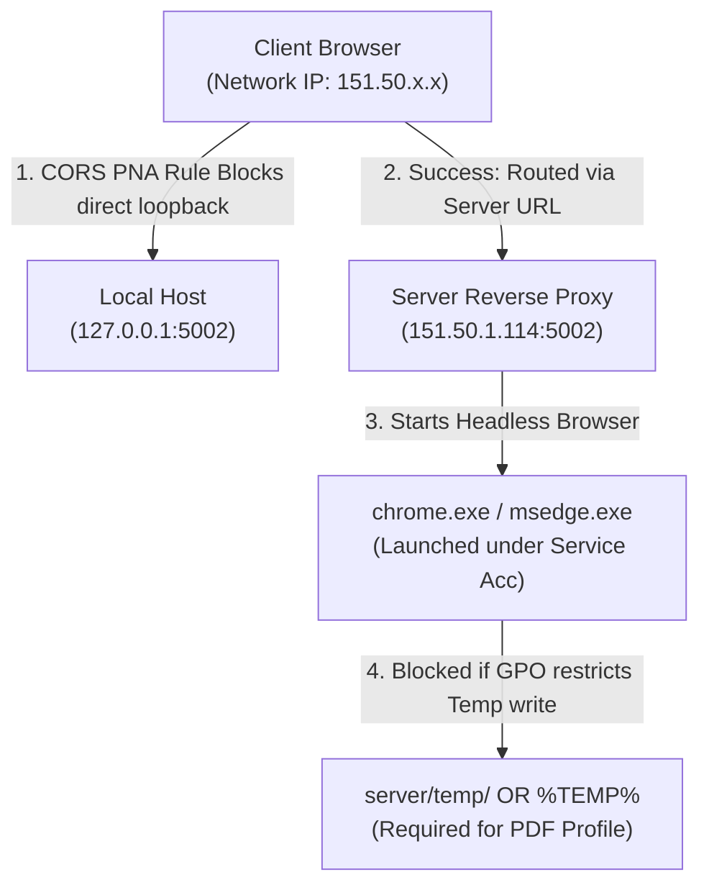

# EMS - IT Infrastructure Support & Security Policy Validation Request

> [!IMPORTANT]
> **Action Required**: IT Infrastructure, Security Operations (SecOps), and Windows/Active Directory Administrators are requested to validate the environment configurations, Group Policies (GPOs), folder permissions, and endpoint security rules outlined below to ensure the stability of the **Enquiry Management System (EMS)** production deployment.
> 
> **Deployment Target**: Production Application Server (`151.50.1.114`)
> **Hosting Architecture**: IIS (Frontend SPA Reverse Proxy) + PM2/Node.js (Backend Services on port `5002`)

---

## 1. Executive Summary & Core Objectives
The development team has optimized and packaged the Enquiry Management System (EMS). However, key system integrations—specifically **automated PDF generation**, **Outlook EML draft compilation**, and **headless Chromium execution**—depend heavily on the operating system session context, folder permissions, and private network routing. 

We require the IT team to review, validate, and verify infrastructure and security policies that may impact stable background operation in production.

---

## 2. Infrastructure & IIS Reverse Proxy Verification

To allow users to access the app via a single domain/IP context (`http://151.50.1.114:5173` or a production DNS), IIS must successfully proxy backend requests to the Node.js service running on port `5002` locally.

| IIS Component | Requirement | IT Verification Task | Status |
| :--- | :--- | :--- | :--- |
| **IIS ARR** | Application Request Routing must be **Enabled** | Open IIS Manager -> Application Request Routing -> Server Settings -> Verify **"Enable proxy"** is checked. | `[ ] Pending` |
| **URL Rewrite** | IIS URL Rewrite Module 2.1+ must be installed | Verify rewrite rules inside `web.config` are active and not throwing HTTP 500 errors. | `[ ] Pending` |
| **Reverse Proxy Rule** | Route all `/api/*` traffic to `http://localhost:5002/api/*` | Verify that requests to `http://151.50.1.114:5173/api/quote-pdf/health` successfully reach port 5002 and do not return 504 Gateway Timeout. | `[ ] Pending` |

---

## 3. Windows OS Compatibility & Session Isolation

The backend utilizes **Puppeteer (Headless Chromium)** to generate print-ready quote PDFs. On legacy systems, background headless execution is highly unstable.

*   **Operating System Check**: The server is reported to be running Windows 8.1. Headless Chromium execution and modern DevTools Protocol (CDP) require updated Windows kernels (win32 session handling improvements) to prevent startup hangs.
*   **IT Recommendation**: **Upgrade the hosting OS to Windows Server 2019 or Windows Server 2022** (or at minimum Windows 10) to support stable headless container execution under Session 0.
*   **Session 0 Isolation**: Headless Chrome runs as a background process managed by PM2/IIS under a non-interactive Windows Session 0. SecOps must ensure that **interactive desktop requirements** are disabled for headless execution.

---

## 4. Security Policies & GPO (Group Policy Object) Validation

Enterprise active directory and network GPOs can actively block the local integrations required for EMS.



> [!WARNING]
> **Active GPO Checks Required**:
> 
> *   **Localhost / Loopback Access Restrictions**: Verify that loopback boundary rules or local host name resolution policies are not blocking internal loopback requests on `localhost:5002`.
> *   **Private Network Access (PNA) Policy**: Chrome's PNA security blocks insecure contexts (HTTP) from calling more-private networks (loopback). All client-to-server calls must go strictly through the server IP/domain (`151.50.1.114`), never using `127.0.0.1` locally in client code.
> *   **EML File MIME Associations**: Outlook EML email drafts are generated on the server and downloaded by the client browser. Ensure client browser GPOs permit downloading and opening `.eml` MIME types inside Outlook.
> *   **Temporary Directory Execution**: Verify that GPOs or AppLocker policies do not enforce **no-execute** (`NO_EXECUTE`) rules on Windows temporary folders or subfolders of the application root. Chrome must be allowed to write and initialize cache files in `server/temp/`.

---

## 5. Antivirus & Endpoint Detection and Response (EDR) Whitelisting

Endpoint security suites (such as Windows Defender, CrowdStrike, SentinelOne) often flag headless browsers launched by Node.js as suspicious behavior.

*   **Process Whitelisting**:
    *   `node.exe` (Node.js runtime)
    *   `pm2.exe` / `pm2` process manager wrappers
    *   `chrome.exe` / `msedge.exe` (when launched by `node.exe` from `C:\Program Files\` or local Puppeteer cache directories)
*   **Path Whitelisting**:
    *   The entire application folder: `D:\Data\EMS Online\EMS\` (or `C:\EMS\`)
    *   The temporary directory: `server/temp/` (used for Chromium user-data profiles and HTML render sheets)
    *   The uploads folder: `server/uploads/` (used for enquiry/quote attachments)
*   **File Extension Integrity**:
    *   Ensure generated vector PDF files (`.pdf`) and temporary email draft binaries (`.eml`) are not locked in real-time by antivirus file-access scans during the brief window they are compiled and sent to the client.

---

## 6. Service Account & Directory Access Permissions

The Node.js backend must run under a dedicated, low-privilege service account. IIS AppPool identities and PM2 services must be granted explicit NTFS permissions.

> [!IMPORTANT]
> **Required Folder Access Permissions (NTFS)**:
> 
> We have redirected all headless browser profile caches and temporary compilation files to a local `server/temp` folder within the application root to isolate permissions. The **IIS AppPool identity** and the **PM2 execution user account** must be granted **Full Read / Write / Delete** permissions on the following folders:

```
[Application Root]
 ├── server/
 │    ├── temp/        <-- CRITICAL: Full Read/Write/Delete (Chrome User Profile & PDF Cache)
 │    ├── uploads/     <-- CRITICAL: Full Read/Write/Delete (User Enquiries & Attachments)
 │    └── logs/        <-- CRITICAL: Full Read/Write (PM2 System & Application Logs)
```

---

## 7. Firewall & Network Port Boundaries

| Connection Path | Port | Protocol | Purpose | IT Verification Task |
| :--- | :--- | :--- | :--- | :--- |
| **Client -> Server** | `5173` | HTTP | Frontend application interface | Ensure port 5173 is open on the host firewall for client browser access. |
| **Client -> Server API** | `5002` | HTTP | Express Backend endpoints | Open port 5002 on the local Windows Defender firewall on server `151.50.1.114`. |
| **Server -> Database** | `1433` (or custom) | TCP | MSSQL Database (`151.50.1.116`) | Verify connection to SQL Server database `EMS_DB` is open from the server host. |
| **Server -> Mail Gateway**| `25` (or `587`) | SMTP | Notification Mail Relay (`almoayyedcg-com...`) | Ensure outbound SMTP traffic is allowed from the server host to the SMTP server. |

---

## 8. Machine-Wide Chromium Browser Installation

Puppeteer requires a stable, modern Chromium engine to render vector PDFs. 

*   **Current Issue**: The server is pointing to a 32-bit Chrome installation in `C:\Program Files (x86)\...` which is timing out (120s), likely due to corruption or outdated components.
*   **IT Recommendation**: **Use Microsoft Edge (Pre-installed)** OR **Install Google Chrome machine-wide** in the standard 64-bit directory instead of a user-profile-only appdata folder.
*   **Verification paths**:
    *   **Microsoft Edge (Recommended)**: `C:\Program Files\Microsoft\Edge\Application\msedge.exe`
    *   **Google Chrome (64-bit)**: `C:\Program Files\Google\Chrome\Application\chrome.exe`

---

## 9. Sign-Off & IT Validation Checklist

Before marking the infrastructure transition complete, the IT team should verify the following endpoints directly on the server `151.50.1.114`:

*   [ ] **Health Endpoint Probe**: Open `http://localhost:5002/api/quote-pdf/health?launch=1` and ensure it returns `launchProbe: { ok: true }` instantly.
*   [ ] **Database Connection Check**: Verify the Express backend console log prints `Connected to MSSQL Database` on startup.
*   [ ] **Outbound Mail Check**: Verify SMTP mail logs show successful delivery of test emails.
*   [ ] **Reverse Proxy Verification**: Open `http://151.50.1.114:5173/api/quote-pdf/health` from a remote computer on the network and verify it returns a valid JSON response (proving URL rewrite is fully functional).

---
*Prepared by EMS Application Development Team*
